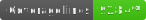
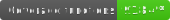
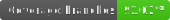

# collections

A library which provides different collection objects, such as SortedArray

## SortedList + SortedArray

The SortedArray implementation, based on the SortedList abstraction, lets us work with a list which is sorted at all times. Thus, we can perform retrievals using binary search in _O(logn)_ time instead of _O(n)_ time. The abstraction is based on three main concepts:

-   **ComparableType**: the minimum type definition needed to run a comparison against two elements in the list.
-   **DataType**: the full data type to be stored in the list. Default value is equal to ComparableType.
-   **Comparer**: a callback which will accept two instances of _ComparableType_ and return a number indicating their relative order.

SortedArray will take 1-2 arguments in its constructor:

-   **Comparer**: function which will compare two of its items
-   **InitialList**: an initial iterable which we can use to initialize this array

## Default Comparers

The following comparers are available as static methods on the SortedArray class:

-   **compareNumbers**: compare as _a - b_,
-   **compareStrings**: compare as _a.localeCompare(b)_
-   **compareDates**: compare as _+a - +b_
-   **compareFromComparable**: compare as *a.compareTo(b)\*\*, anything which implements the *iComparable\* interface
-   **compareFromProperty**: we can compare based on a single property which exists on _ComparableType_ with the given comparer method

## Equality Set

The EqualitySet implementation extends the SortedArray and provides the additional benefit that only unique items will be added to the set. The instance is constructed in the same way that a SortedArray is.

## Graph and Tree

All type definitions for the Graph and Tree (which is based on Graph implementation) can be found in the models folder.